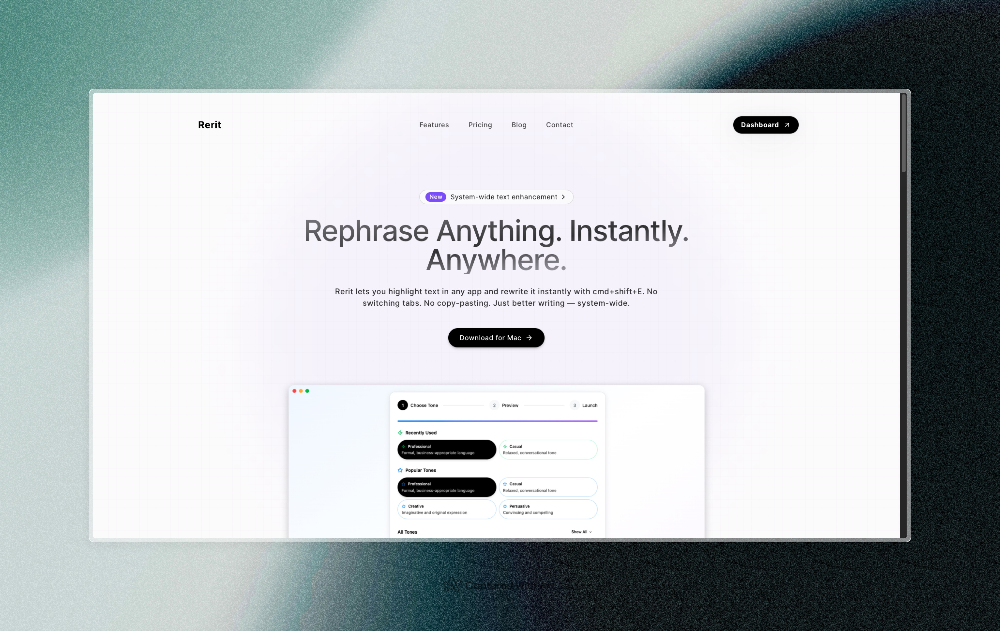

# Rerit - AI-Powered Text Rewriter

A powerful desktop application that transforms your text with AI-powered tone adjustments. Use global shortcuts to instantly rewrite selected text across any application.



## ✨ Features

- **Global Shortcut**: Use `Cmd+Shift+E` (macOS) or `Ctrl+Shift+E` (Windows/Linux) to rewrite selected text anywhere
- **Multiple Tones**: Professional, casual, friendly, urgent, creative, and more
- **Custom Tones**: Create your own tone profiles with custom descriptions
- **Cross-Platform**: Works on Windows, macOS, and Linux
- **Secure Authentication**: OAuth integration with secure credential storage
- **Background Operation**: Runs in system tray for instant access
- **Real-time Processing**: Fast AI-powered text transformation

## 🚀 Installation

### Download Pre-built Releases

Download the latest version for your platform from the [Releases](https://github.com/Huzaifa-Saleem/rerit-desktop-app/releases) page:

- **Windows**: `Rerit Setup 1.0.0.exe` (98 MB)
- **macOS**: `Rerit-1.0.0.dmg` (120 MB)  
- **Linux**: `Rerit-1.0.0.AppImage` (123 MB)

### Installation Instructions

#### Windows
1. Download `Rerit Setup 1.0.0.exe`
2. Run the installer and follow the setup wizard
3. Launch Rerit from the Start Menu or Desktop

#### macOS
1. Download `Rerit-1.0.0.dmg`
2. Open the DMG file
3. Drag Rerit to your Applications folder
4. Launch from Applications (you may need to allow the app in Security & Privacy settings)

#### Linux
1. Download `Rerit-1.0.0.AppImage`
2. Make it executable: `chmod +x Rerit-1.0.0.AppImage`
3. Run: `./Rerit-1.0.0.AppImage`

## 🎯 Usage

### Quick Start
1. **Sign In**: Launch Rerit and sign in with Google
2. **Select Text**: Highlight any text in any application
3. **Rewrite**: Press `Cmd+Shift+E` (macOS) or `Ctrl+Shift+E` (Windows/Linux)
4. **Done**: The selected text is automatically replaced with the rewritten version

### Available Tones
- **Professional**: Business-appropriate language
- **Casual**: Relaxed and informal
- **Friendly**: Warm and approachable
- **Urgent**: Conveys importance and urgency
- **Creative**: Imaginative and expressive
- **Concise**: Short and to the point
- **Detailed**: Comprehensive and thorough
- **Custom**: Create your own tone profiles

### System Tray Features
- **Enable/Disable Shortcut**: Toggle global shortcut functionality
- **Quit**: Exit the application completely

## 🛠️ Development

### Prerequisites
- Node.js 18+ 
- Yarn or npm package manager

### Setup

```bash
# Clone the repository
git clone https://github.com/Huzaifa-Saleem/rerit-desktop-app.git
cd rerit-desktop-app

# Install dependencies
yarn install
# or
npm install
```

### Development Scripts

```bash
# Start development server
yarn dev
# or
npm run dev

# Build for production
yarn build
# or  
npm run build

# Build for specific platforms
yarn build:win    # Windows
yarn build:mac    # macOS
yarn build:linux  # Linux

# Type checking
yarn typecheck
# or
npm run typecheck
```

### Project Structure

```
src/
├── main/           # Electron main process
│   ├── index.ts    # Main application logic
│   ├── createWindow/ # Window management
│   └── utils/      # Utility functions
├── preload/        # Electron preload scripts
│   └── index.ts    # IPC bridge
└── renderer/       # React frontend
    ├── src/
    │   ├── components/ # React components
    │   ├── pages/      # Application pages
    │   ├── hooks/      # Custom React hooks
    │   ├── services/   # API and business logic
    │   └── config/     # Configuration files
    └── index.html
```

### Environment Variables

```bash
# .env file
VITE_API_URL=https://rerit.vercel.app  # Production API URL
```

## 🔧 Configuration

### API Integration
The app connects to the Rerit API for text processing. You can configure the API URL through environment variables or modify the default in the source code.

### Global Shortcuts
The global shortcut can be customized in `src/main/index.ts`. Current default is `CommandOrControl+Shift+E`.

## 🤝 Contributing

We welcome contributions! Please see our [Contributing Guidelines](CONTRIBUTING.md) for details.

### Development Guidelines
1. Follow the existing code style and conventions
2. Write clear commit messages
3. Add tests for new features
4. Update documentation as needed

### Reporting Issues
Please use the [GitHub Issues](https://github.com/Huzaifa-Saleem/rerit-desktop-app/issues) page to report bugs or request features.

## 📄 License

This project is licensed under the MIT License - see the [LICENSE](LICENSE) file for details.

## 🔒 Privacy & Security

- **Local Storage**: Authentication tokens are encrypted and stored locally
- **No Data Collection**: We don't collect or store your text data
- **Secure Communication**: All API communications use HTTPS
- **Open Source**: Full transparency with open source code

## 🆘 Support

- **Documentation**: Check this README and inline code comments
- **Issues**: Report bugs on [GitHub Issues](https://github.com/Huzaifa-Saleem/rerit-desktop-app/issues)
- **Discussions**: Join conversations in [GitHub Discussions](https://github.com/Huzaifa-Saleem/rerit-desktop-app/discussions)

## 🏗️ Built With

- **Electron** - Desktop application framework
- **React** - Frontend library
- **TypeScript** - Type-safe JavaScript
- **Vite** - Build tool and development server
- **Tailwind CSS** - Utility-first CSS framework
- **Electron Builder** - Application packaging

## 🎉 Acknowledgments

- Thanks to all contributors who help improve Rerit
- Built with modern web technologies and best practices
- Inspired by the need for seamless text transformation workflows

---

**Made with ❤️ by [Huzaifa Saleem](https://huzaifasaleem.com)**
